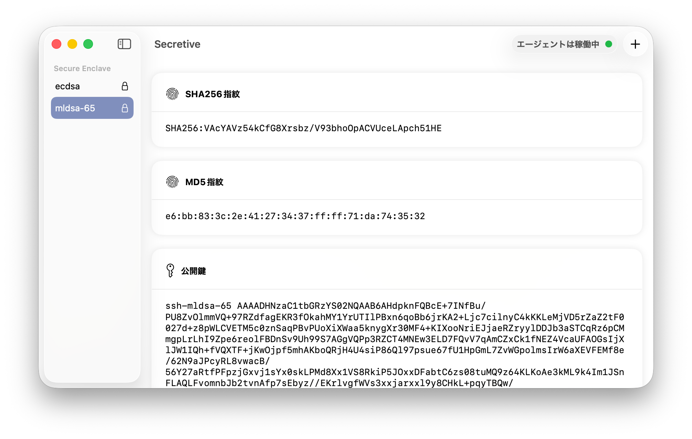
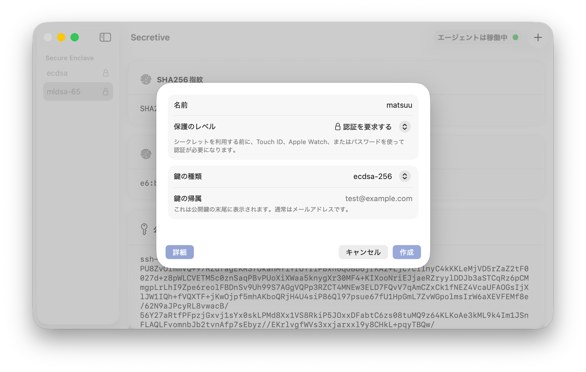
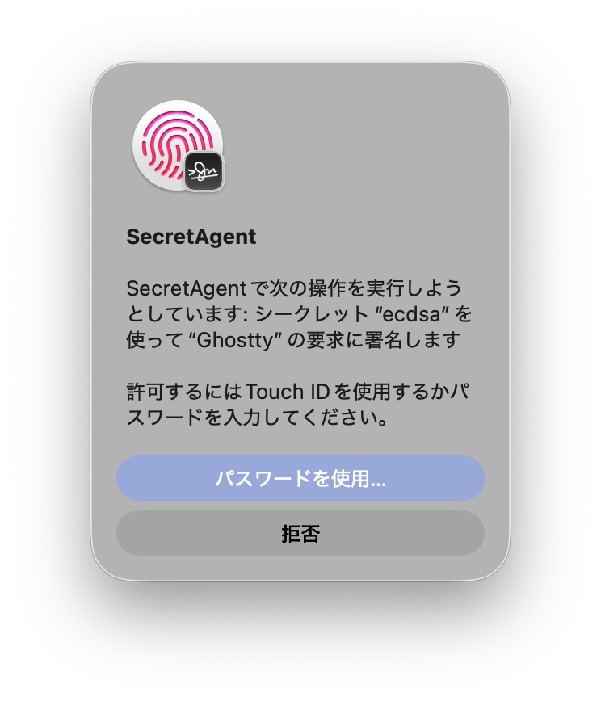
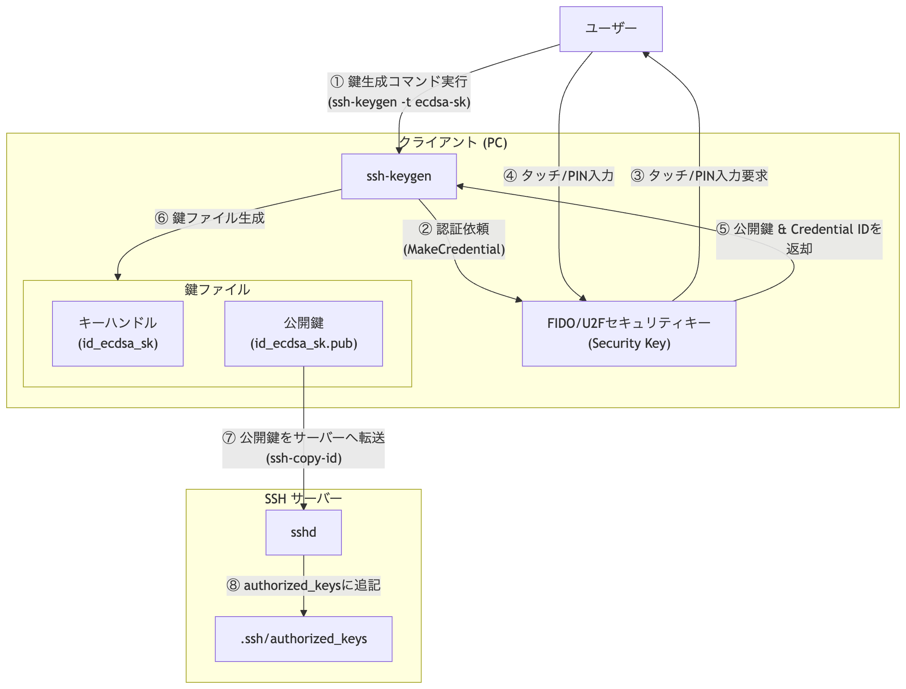
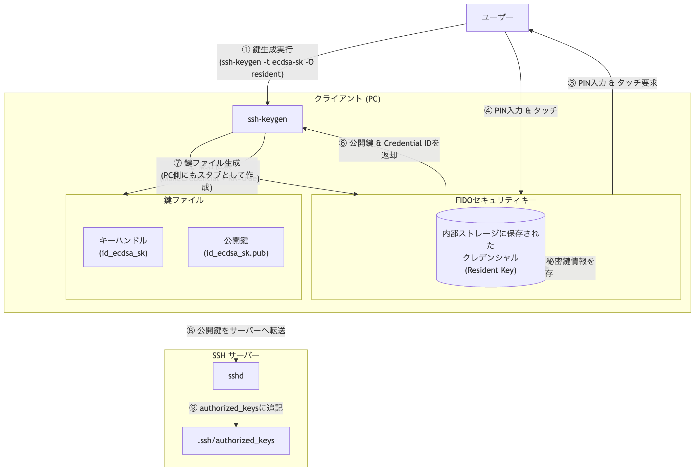
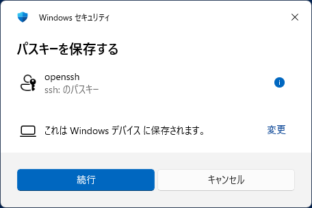
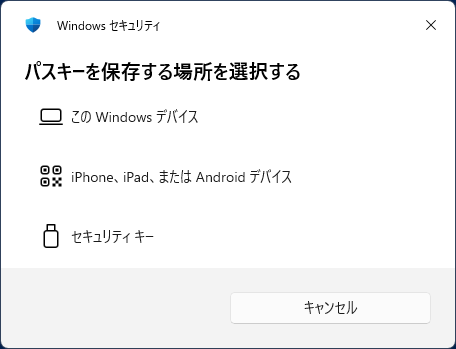
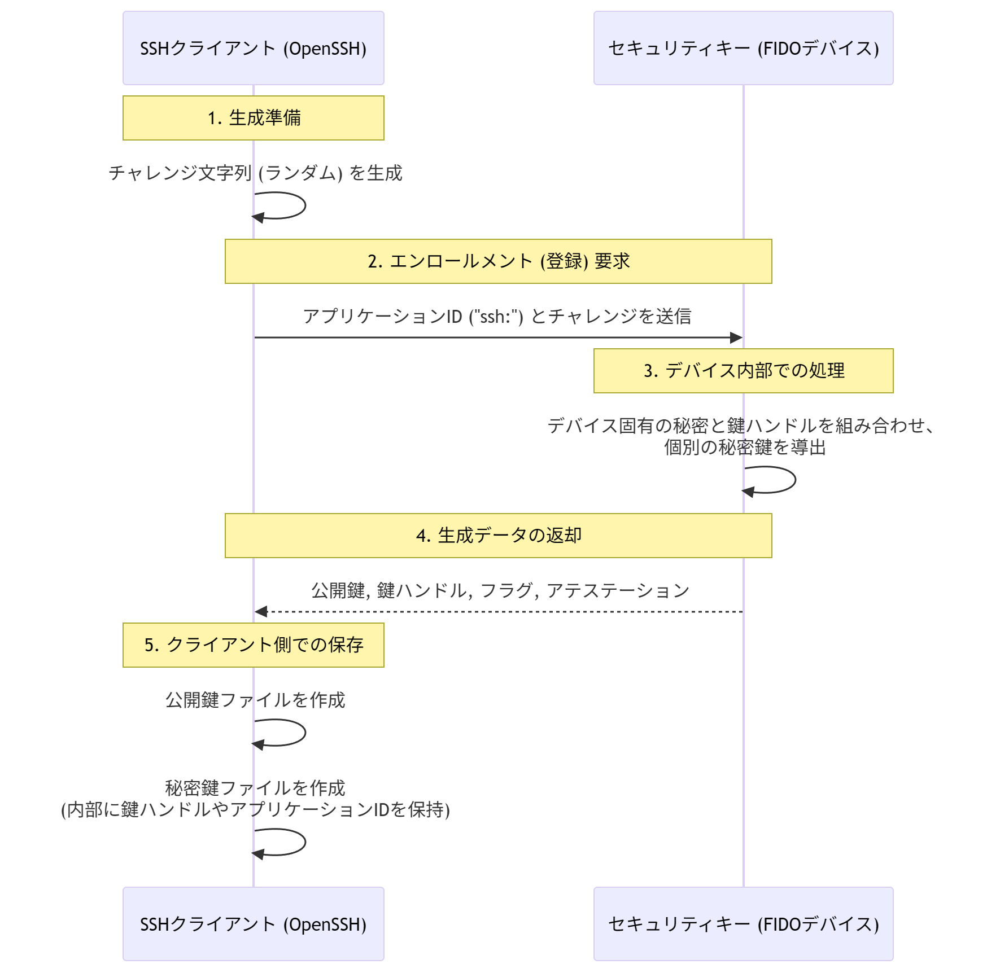
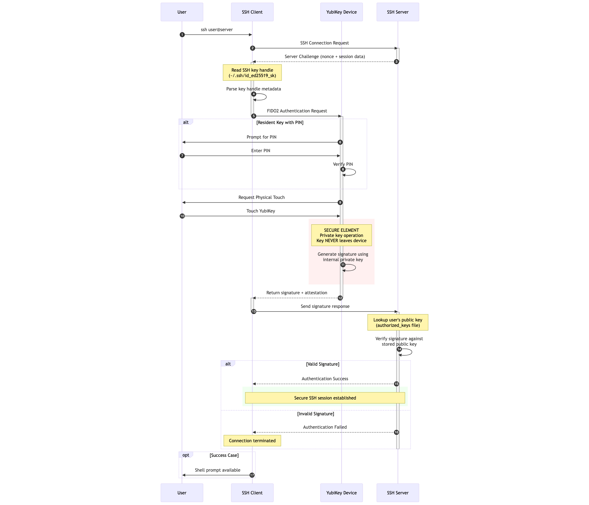

アジェンダ
==========

1. 自己紹介
2. 背景と課題
3. 複製不可能な鍵運用とは
4. 代表的な方式と選び方
5. 導入デモ手順
6. まとめ

---

自己紹介
========================

<!-- column_layout: [2, 1] -->
<!-- column: 0 -->
* matsuuです
    * X **@matsuu**
    * Bluesky **@matsuu.bsky.social**
    * Mastodon **@matsuu@fedibird.com**
    * mixi2 **@tmatsuu**
    * はてな **@tmatsuu**
* 主に技術ネタをはてブ→SNSに共有する驚き屋
* 好きなTerminal
    * Ghostty
    * Windows Terminal
    * foot
* Terminalは白地に黒文字派。ThemeはDimidium推し
* 気になっているCLI/TUIツール
    * SecretSpec [](https://secretspec.dev/)
    * Gonzo [](https://github.com/control-theory/gonzo)
    * DuckDB [](https://duckdb.org/)
    * TUIOS [](https://github.com/Gaurav-Gosain/tuios)
* このプレゼンはMacbookNeo+Kitty+presentermで構成されています
<!-- column: 1 -->


<!-- reset_layout -->

---

背景: いま起きていること
========================

* SSHを使うシーンが増えている(かも)
    * CLI/TUIベースの生成AIサービスの利用
    * GitHub/GitLab/PaaSへのアクセス
    * クラウドVM、コンテナホスト、検証環境への日常的な接続
* 開発スタイルが分散し、接続元が多様化している
    * ノートPC、スマートフォン、タブレット、リモート端末からの作業

---

課題: 従来運用の典型的なリスク
========================

* `~/.ssh/id_rsa` や `~/.ssh/id_ed25519` などに秘密鍵が保存されている
    * 総当たりやキーロガー、復号後のメモリ窃取は防げない
    * 利便性優先で空パスフレーズ運用になることも？
* パスワードマネージャに保存している場合も、Vault自体の漏えいや乗っ取りのリスクがある
    * 秘密鍵がエクスポート可能な状況だと複製リスクは残る
* バックアップや同期が裏目に出ることがある
    * Time Machine、クラウド同期、ホームディレクトリ移行などで複製される
    * 「消したつもりでも別の場所に残る」が起こりやすい
* ソフトウェア実装の鍵は漏えい検知が難しい
    * ブラウザ拡張、サプライチェーン攻撃、情報窃取マルウェア(Infostealer)など侵入経路が多い
    * いったん端末が侵害されると、ローカル保存された秘密鍵は狙われやすい

---

<!-- jump_to_middle -->
端末は侵害される前提で考える時代
---------------------------

---

複製不可能な運用とは
======================

* 秘密鍵をプラットフォームの鍵保護機構内で生成し、外部エクスポート不可で運用
    * 生成時からエクスポート不可属性を持たせる
    * OSやアプリが秘密鍵のバイト列を直接読み取ることができない
* 外部に出るのは基本的に「公開鍵」と「署名結果」だけ
    * クライアントは公開鍵をサーバーに登録する
    * 認証時はチャレンジに対する署名結果のみを返す
* 署名実行には追加条件を課せる
    * PIN入力、生体認証、デバイスへのタッチ、端末のロック解除状態など
    * これにより「鍵がある」だけでなく「利用者の関与」を要求できる
* 端末侵害時でも被害を限定しやすい
    * 秘密鍵ファイルそのものを窃取されない
    * バックアップ/同期経由での複製拡散を抑止しやすい
* 「物理ハードウェアに紐づけられたSSH鍵」と考えるとわかりやすい

---

主な方式の紹介
==============

| 格納先 | 製品例 | 対応クライアント例 |
|---|---|---|
| Secure Enclave | macOS, iPhone, iPad | Secretive, Blink, Termius  |
| FIDOデバイス | YubiKeyなど | libfido2+openssh, Termius, putty-cac |
| Android Keystore | Android端末 | Termius |
| TPM 2.0 | クライアントPC, サーバ など | ssh-tpm-agent, tpm2-pkcs11, Termius |
| PIV | YubiKey, SmartCardなど | openssh |

* Secure Enclave: [](https://support.apple.com/ja-jp/guide/security/sec59b0b31ff/web)
* FIDOデバイス: [](https://fidoalliance.org/specifications-overview/?lang=ja)
* Android Keystore: [](https://developer.android.com/privacy-and-security/keystore?hl=ja)
* TPM 2.0: [](https://trustedcomputinggroup.org/resource/tpm-library-specification/)
* PIVデバイス: [](https://www.nist.gov/identity-access-management/personal-identity-verification-piv)

# 今回はSecure EnclaveとFIDOデバイスについて取り上げます

---

<!-- jump_to_middle -->
Secretiveの紹介
========================

---

Secretiveの紹介
========================

* [](https://secretive.dev/)
* Secure Enclave内でSSH秘密鍵を生成できるmacOS用アプリ
* Secretiveのエージェントがバックグラウンドで稼働、アプリと橋渡し
* 扱える鍵の種類は `ecdsa-256` / `mldsa-65` / `mldsa-87`
* SSH Agent Forwardingにも対応している
* オープンソース実装 [](https://github.com/maxgoedjen/secretive)

RSAやED25519には対応していません。

---

mldsa-65, mldsa-87 について
============================

* ML-DSAと呼ばれる耐量子暗号アルゴリズム
* サポートしているSSH実装はおそらくほぼ存在しない
* OpenSSHも公式には未サポート（2026年3月時点）
    * Open Quantum Safe プロジェクトが提供するフォーク実装はある
    * [](https://github.com/open-quantum-safe/openssh)

---

Secretiveセットアップ
===================

## homebrewを使ってインストールする場合

```sh
brew install secretive
```

## SSH設定

`~/.ssh/config` に以下を追記

```ssh_config
Host *
  IdentityAgent /Users/YOURNAME/Library/Containers/com.maxgoedjen.Secretive.SecretAgent/Data/socket.ssh
```

もしくは `~/.zshrc` に以下を追記

```zshrc
export SSH_AUTH_SOCK="${HOME}/Library/Containers/com.maxgoedjen.Secretive.SecretAgent/Data/socket.ssh"
```

---

Secretive メイン
========================



---

Secretive SSH鍵生成/接続時
========================

<!-- column_layout: [2, 1] -->
<!-- column: 0 -->

<!-- column: 1 -->

<!-- reset_layout -->

---

<!-- jump_to_middle -->
FIDOデバイス(FIDO/U2Fセキュリティキー)
==================================

---

FIDOデバイス(FIDO/U2Fセキュリティキー)
==================================

* OpenSSH 8.2 で、FIDO/U2F セキュリティキーを使う `-sk` 鍵種（`ecdsa-sk` / `ed25519-sk`）が追加された
* FIDOデバイス固有の秘密鍵と鍵ハンドル (Key Handle) を組み合わせて個別の秘密鍵を導出
* `id_ecdsa_sk` / `id_ed25519_sk` が生成されるが、従来の秘密鍵ファイルとは役割が異なる
    * 実体は「FIDOデバイス内の鍵を参照するためのハンドル情報」であり、秘密鍵そのものは含まれない
    * 端末侵害時にこれらのファイルを盗まれても、認証器本体とPIN/タッチ確認がなければ悪用できない
* この仕組みは「複製されにくい運用」と「利用時の本人関与（タッチ/PIN）」を同時に実現できる
* 鍵ハンドルを導出できる resident 機能というものがある
    * resident を有効にすると鍵ハンドルを導出するためのcredentials情報をFIDOデバイスに格納することが可能
    * resident 有効時の鍵ハンドル生成はPIN入力が必須

---

OpenSSH+FIDOの鍵生成フロー
=========================================



---

OpenSSH+FIDOの鍵生成フロー(residentの場合)
=========================================



---

鍵作成手順
========

FIDOデバイスを接続した状態で以下を実行する

```bash
ssh-keygen -t <ed25519-sk|ecdsa-sk> [-O verify-required] [-O resident] -C "my-fido-key"

# 生成物の例
# ~/.ssh/id_ed25519_sk      (鍵ハンドル)
# ~/.ssh/id_ed25519_sk.pub  (公開鍵)
```

* `-t ed25519-sk`: `sk-ssh-ed25519@openssh.com` の鍵を生成
* `-t ecdsa-sk`: `sk-ecdsa-sha2-nistp256@openssh.com` の鍵を生成
* `-O verify-required`: PIN/生体確認を要求
* `-O resident`: FIDOデバイス側にcredentials情報を保持

---

よくあるつまずき
================

* `ecdsa-sk` / `ed25519-sk` 鍵が使えるのはOpenSSH 8.2以降
* macOS標準のopensshはFIDOに対応していない(2026年3月時点)
    * Homebrewなどで別途opensshのインストールが必要
* FIDOデバイスによってサポート範囲にばらつきがある
    * `ecdsa-sk` は対応しているが `ed25519-sk` には対応していないなど
* FIDOデバイスを紛失すると復旧できない
* 鍵ハンドルを紛失すると復旧できない(residentであれば導出可能)

---

SSHクライアントのFIDO対応状況
================================

| クライアント | FIDO対応 | 備考 |
|---|---|---|
| OpenSSH 8.2以降 | ✅ | sk-ssh鍵をネイティブサポート |
| macOS標準 OpenSSH | ⚠️ | Homebrew等でopensshの別途インストールが必要 |
| Win32-OpenSSH | ✅ | V8.9.0.0からサポート |
| PuTTY | ⚠️ | 代替として `PuTTY CAC` が利用可能 |
| WSL2 | ⚠️ | usbipd-winかWindows側SSHエージェントへのブリッジが必要 |
| Termius (Android/iOS) | ✅ | FIDO/Android Keystore/Secure Enclaveに対応 |
| TeraTerm | ❌ | issueは立っている |

* PuTTY CAC: [](https://github.com/NoMoreFood/putty-cac)
* Termius: [](https://termius.com/)
* TeraTerm: [](https://github.com/TeraTermProject/teraterm/issues/900)

---

Win32-OpenSSHとPuTTY CACの補足
================================

<!-- column_layout: [2, 1] -->
<!-- column: 0 -->
* Win32-OpenSSHとPuTTY CACの保存先はFIDOデバイス(セキュリティキー)だけではない
* WebAuthn API経由でパスキーの扱いになり、以下の中から選べる
    * このWindowsデバイス(おそらくTPM2.0)
    * iPhone、iPad、または Android デバイス
    * セキュリティキー
<!-- column: 1 -->


<!-- reset_layout -->

---

<!-- jump_to_middle -->
FAQ 
===

---

<!-- jump_to_middle -->
Q: どれを採用するとよさそう?
==========================

---

Q: どれを採用するとよさそう?
==========================

## macOS

* Secretive(Secure Enclave)
* OpenSSH(homebrew) + FIDOセキュリティキー

## Linux

* OpenSSH + FIDO セキュリティキー
* 今回紹介しなかったが TPM2.0 も選択肢としてあり

## Windows

* Win32-OpenSSH + FIDOデバイス
* PuTTY CAC + FIDOデバイス

再掲: WindowsにおいてはFIDOデバイスとしてセキュリティキーだけでなくWindows自身やAndroid/iOS端末も利用可能

---

<!-- jump_to_middle -->
Q: スマートフォンの対応状況
==============================

---

Q: スマートフォンの対応状況
==============================

## Android向け

* Termius (Android Keystore, FIDOデバイスに対応)

## iOS向け

* Blink (Secure Enclaveに対応)
* Termius (FIDOデバイス, Secure Enclaveに対応)
* Secure Terminal (Secure Enclaveに対応)

---

<!-- jump_to_middle -->
Q: おすすめのFIDOデバイスは?
==========================

---

Q: おすすめのFIDOデバイスは?
==========================

* Yubico社のSecurity Keyシリーズ
    * FIDO対応で安価
    * 公式サイトで$29+送料
    * 国内正規代理店(softgiken)で6,600円+送料
    * Amazonでも販売あり
* Yubico社のYubikey 5シリーズ
    * FIDOだけでなくSmartCard, OTP, OpenPGP3 などマルチプロトコル対応
* Google Titan Security Keyは制約あり
    * `ecdsa-sk` は対応
    * `resident` と `ed25519-sk` に対応していない
* GoTrustID Idem Keyは制約あり
    * `ecdsa-sk` は対応
    * `resident` と `ed25519-sk` に対応していない
* Yubico社製品の中古の購入はオススメしない
    * 古いFirmwareだと対応していない可能性がある
    * `ecdsa-sk` はFIDO2サポートを謳うYubikeyであれば対応
    * `verify-required` と `resident` は firmware 5.1.2以降で対応
    * `ed25519-sk` は firmware 5.2.3以降で対応

---

<!-- jump_to_middle -->
Q: 生成できるSSH公開鍵形式
==================================

---

Q: 生成できるSSH公開鍵形式
==================================

| 格納先 | RSA | ED25519 | ECDSA | ED25519-SK | ECDSA-SK | ML-DSA |
|---|---|---|---|---|---|---|
| Secure Enclave | ❌ | ❌ | ✅ | ❌ | ❌ | ✅ |
| FIDOデバイス | ❌ | ❌ | ❌ | ⚠️ | ⚠️ | ❌ |
| Android Keystore | ❌ | ❌ | ✅ | ❌ | ❌ | ❌ |
| TPM 2.0 | ✅ | ❌ | ✅ | ❌ | ❌ | ❌ |
| PIV | ✅ | ❌ | ✅ | ❌ | ❌ | ❌ |

* FIDOデバイス: デバイスによってはサポートしていない場合がある

---

<!-- jump_to_middle -->
Q: 主要サービスのSSH公開鍵形式サポート状況
======================================

---

Q: 主要サービスのSSH公開鍵形式サポート状況
======================================

| サービス | RSA | ED25519 | ECDSA | ED25519-SK | ECDSA-SK | ML-DSA |
|---|---|---|---|---|---|---|
| GitHub | ✅ | ✅ | ✅ | ✅ | ✅ | ❌ |
| GitLab | ✅ | ✅ | ✅ | ✅ | ✅ | ❌ |
| AWS | ✅ | ✅ | ⚠️ | ❌ | ❌ | ❌ |
| Google Cloud | ⚠️ | ⚠️ | ⚠️ | ⚠️ | ⚠️ | ⚠️ |
| Microsoft Azure | ✅ | ✅ | ❌ | ❌ | ❌ | ❌ |
| OpenSSH | ✅ | ✅ | ✅ | ✅ | ✅ | ❌ |

* AWS: EC2 KeypairはECDSA未対応、AWS Transfer FamilyはECDSA対応
* Google Cloud: SSH公開鍵のフォーマットを厳密に検証していない模様。架空の形式でもUI上は受け付ける場合がある

---

<!-- jump_to_middle -->
Q: 秘密鍵は取り出せるのか?
=============================

---

Q: 秘密鍵は取り出せるのか?
=============================

* 取り出せません
    * 取り出せるのであればそれは異なる仕組みになっている
    * 実装によっては、意図的にエクスポート可能な鍵を生成するモードもあるため注意が必要
        * Android KeystoreやTPM 2.0など

---

<!-- jump_to_middle -->
Q: バックアップは可能か?
==========================

---

Q: バックアップは可能か?
==========================

* 取り出せない＝バックアップ不可能
* 予備デバイスなどで冗長性を担保する

---

<!-- jump_to_middle -->
Q: OSをアップグレードしても使えるのか?
=========================================

---

Q: OSをアップグレードしても使えるのか?
=========================================

* 利用可能
    * Secure Enclave(Secretive)で確認
    * FIDOデバイス（YubiKeyなど）はアップデートの概念がなさそう
* 念のため、複数の認証手段や代替デバイスを持っておくのが安全

---

<!-- jump_to_middle -->
Q: OSを再インストールしても使えるのか?
=========================================

---

Q: OSを再インストールしても使えるのか?
=========================================

* FIDO2セキュリティキー
    * リセット機能はある
* Secure Enclave
    * OSを再インストールすると鍵情報は削除される

---

<!-- jump_to_middle -->
Q: 複数端末から1つの鍵で接続したい
==========================================

---

<!-- jump_to_middle -->
考え方を変えろ
==========================================

---

Q: 複数端末から1つの鍵で接続したい
==========================================

* 「鍵を共有」するのではなく「端末ごとに鍵を発行して公開鍵を登録」するのを推奨
* サーバー側の `authorized_keys` などに端末分の公開鍵を並べる
* 端末を廃棄・紛失した際は、その端末に紐づく公開鍵だけをサーバー側から削除すれば足りる
* 1つの秘密鍵を複数端末に持ち回すのは、複製不可能設計の意味を損なう
* 端末間での可搬性を確保したいならFIDOデバイスがオススメ
    * resident機能を使えばauthorized_keysのエントリーを1つにすることも可能

---

<!-- jump_to_middle -->
Q: デバイスを紛失したらどうなるのか?
======================================

---

Q: デバイスを紛失したらどうなるのか?
======================================

* 秘密鍵を取り出すことはできないため、デジタル的なコピーはできない
* 「知らないうちに鍵が複製されていた」「バックアップから漏洩していた」といったことがない
* FIDOデバイスの場合
    * non-residentはKeyHandleがFIDOデバイス上にないため単体ではログインできない
    * residentはKeyHandleを生成できるが、PIN入力が必須となる
    * 認証のたびにPIN入力を強制することも可
* Secure Enclaveの場合
    * OSへのログインができなければ利用できない
    * 鍵の利用にTouch ID / Apple Watch / パスワードによる認証を必須とする設定も可能
    * OS再インストールすると消える

# 紛失した場合の対処

* 紛失したデバイスの公開鍵をサーバーの `authorized_keys` や各種サービスから削除する
* Secure Enclaveの場合、Macの「探す」でデバイスを消去する

---

<!-- jump_to_middle -->
Q: クラウド上ではどう扱うのか?
========================================

---

Q: クラウド上ではどう扱うのか?
========================================

* SSH Agent Forwardingを利用して、認証処理をローカルデバイスへリレーすることは技術的に可能
* サーバーでTPMが提供されていれば、サーバー上のTPMを利用して鍵を保護するのも一つの選択肢
    * Amazon EC2は NitroTPM の提供あり
    * Azureは vTPM の提供あり
    * Google Cloudは vTPM の提供あり
    * さくらのクラウドは vTPM の提供あり(機密コンピューティング)

---

<!-- jump_to_middle -->
ご清聴ありがとうございました
================================

---

参考 FIDOデバイス鍵生成の流れ
=====================



---

参考 FIDOデバイス認証の流れ
===================


